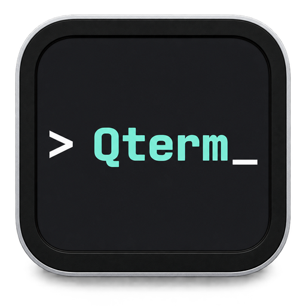
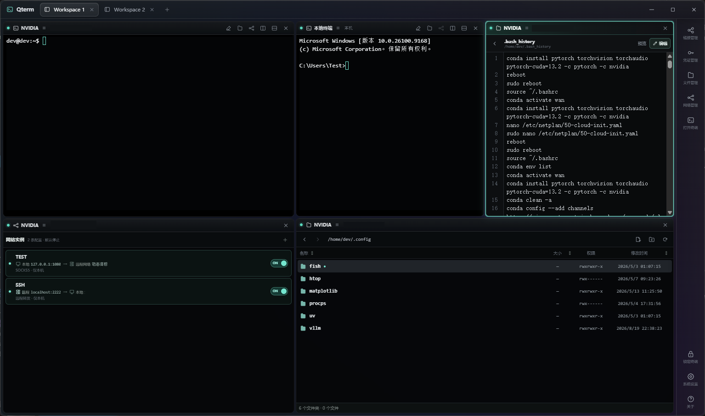

<div align="center">
  
  <h1>Qterm</h1>
  <p>轻量、安全、跨平台的 SSH 终端与远程文件工作台</p>
</div>

Qterm 基于 Tauri 2、React、TypeScript 与 Rust 构建，将本地终端、SSH 会话、SFTP 文件管理和网络转发组织在可持久化、可自由拆分的 Workspace 中。

## 项目状态

| 项目 | 当前状态 |
| --- | --- |
| 开发阶段 | `0.1.x`，处于早期开发阶段 |
| 桌面平台 | Windows x64、macOS Apple Silicon、Linux x64 |
| 核心能力 | Workspace、多终端、SSH、SFTP、凭证库、网络转发 |
| 发布方式 | 版本标签触发 GitHub Release；也可从源码运行 |
| 稳定性 | 数据格式与交互仍可能调整，重要环境使用前请评估并备份 |

Qterm 目前适合试用、开发和参与贡献，尚不建议作为未经验证的生产环境唯一运维入口。平台构建范围与具体产物见[发布流程](docs/release.md)。

## 界面预览



截图展示了一个由多个 Block 组成的 Workspace：

- 左上：通过 SSH 连接的远程终端。
- 中上：本地终端，可与远程会话并排工作。
- 右上：远程文本文件预览与编辑。
- 左下：本地、远程与 SOCKS5 网络转发规则。
- 右下：具有路径导航、排序与文件操作能力的 SFTP 文件浏览器。

## 功能介绍

### Workspace 与终端

- **多 Workspace 工作台**：顶部标签直接代表独立工作环境，会话、布局与终端输出在切换后继续保留。
- **自由分割布局**：Terminal、Files 与 Network Block 可以横向或纵向分割，并支持调整比例、重排与最大化。
- **本地与远程终端**：在同一界面中同时运行本机 shell 和 SSH 会话，终端尺寸变化会同步到底层 PTY。
- **会话保护**：支持手动锁定终端界面，也可配置应用内空闲自动锁定。

### SSH 连接与凭证

- **集中管理连接**：保存主机、端口、用户名和认证偏好，并使用单层分组整理连接。
- **多种认证方式**：支持一次性密码、加密保存的密码、OpenSSH 私钥凭证和系统 SSH Agent。
- **严格主机密钥校验**：首次连接显示 SHA-256 指纹并要求确认；已信任主机的密钥发生变化时默认阻断。
- **加密凭证库**：通过 Argon2id 派生密钥，使用 AES-256-GCM 分项加密密码、私钥和口令；支持离线恢复密钥。

### 文件与网络工具

- **SFTP 文件工作区**：Files Block 可独立连接本机或远程目标，支持目录浏览、排序、上传、下载、预览和文本编辑。
- **上下文联动**：可从终端当前目录打开文件工作区，同时保留独立的连接与会话生命周期。
- **网络转发**：Network Block 支持本地端口转发、远程端口转发和本地 SOCKS5 动态代理。
- **可迁移配置**：连接、凭证库和网络规则可以保存到用户指定的数据目录。

安全设计、信任边界与已知残余风险请阅读[安全模型](docs/security-model.md)。

## 快速开始

开发环境需要 Node.js 22、pnpm 11.0.8、Rust 1.97.1，以及对应平台的 Tauri 2 系统依赖。

```bash
pnpm install --frozen-lockfile
pnpm tauri dev
```

`pnpm dev` 仅启动浏览器界面，不包含 Tauri IPC，无法建立真实 SSH/SFTP 连接。各平台依赖、测试和构建命令见[开发指引](docs/DEVELOPMENT.md)。

## 常用操作

快捷键中的 `Mod` 在 macOS 上是 `Command`，在 Windows 和 Linux 上是 `Ctrl`。

| 操作 | 快捷键或手势 |
| --- | --- |
| 新建 Workspace | `Mod+T` |
| 左右分割当前 Block | `Mod+D` |
| 上下分割当前 Block | `Shift+Mod+D` |
| 切换到第 1–9 个 Workspace | `Mod+1` … `Mod+9` |
| 循环切换 Workspace | `Shift+Mod+[` / `Shift+Mod+]` |
| 打开连接管理 | `Mod+K` |
| 重命名 Workspace | 双击标签 |
| 重排 Workspace / Block | 拖动标签或 Block 标题栏 |

## 文档索引

| 文档 | 内容 |
| --- | --- |
| [开发指引](docs/DEVELOPMENT.md) | 环境准备、源码运行、测试、构建与贡献约定 |
| [安全模型](docs/security-model.md) | 凭据、主机密钥、文件传输与信任边界 |
| [故障排查](docs/troubleshooting.md) | SSH、私钥、SFTP 与开发环境常见问题 |
| [发布流程](docs/release.md) | 版本检查、标签发布、CI 产物与失败处理 |
| [产品目标](docs/qb-spec/context/PRODUCT_SPEC.md) | 目标用户、核心流程与产品原则 |
| [架构规范](docs/qb-spec/context/ARCHITECTURE_SPEC.md) | 技术基线、模块边界、数据流与安全规则 |
| [架构决策](docs/qb-spec/context/DECISIONS.md) | 重要设计选择及其背景 |
| [目录地图](docs/qb-spec/DIRECTORY_MAP.md) | 仓库结构与模块职责速查 |
| [功能规格](docs/qb-spec/specs/) | 各项功能的需求、范围与验收标准 |
| [实施计划](docs/qb-spec/plans/) | 对应功能的实现步骤与验证计划 |

## 技术栈

- 桌面框架：[Tauri 2](https://tauri.app/)
- 前端：React 19、TypeScript、Vite、xterm.js、CodeMirror
- 后端：Rust、russh、russh-sftp
- 测试与质量：Vitest、Testing Library、ESLint、Clippy、rustfmt

## 参与贡献

欢迎提交 Issue、设计讨论、文档改进和 Pull Request。开始修改前请阅读[开发指引](docs/DEVELOPMENT.md)，并为认证、主机密钥、凭证持久化、Workspace、布局或文件传输等关键行为补充回归测试。

提交信息遵循 Conventional Commits，例如 `feat: add session search` 或 `fix: reject changed host keys`。界面变更请在 Pull Request 中附截图或录屏。

## 许可证

Qterm 采用 [GNU General Public License version 3](LICENSE)，SPDX 标识为 `GPL-3.0-only`。GPLv3 允许个人使用、修改、再分发和商业使用；分发副本、二进制或衍生作品时，需遵守相应的源码提供、声明保留、修改标注和同许可证授权要求。完整条款以仓库中的许可证正文为准。
